# 🚀 Interactive Resume Portfolio

<div align="center">


**An immersive, animated resume experience showcasing the journey of**  
**Pranav Dhondiram Pawar** | B.Tech CSE (AI & Analytics)

[🌐 **Live Demo**](#) • [📄 **View Code**](.) • [📬 **Contact Me**](#-connect-with-me)

</div>

---

## ✨ What Makes This Special

<table>
<tr>
<td width="50%">

### 🎨 **Visual Excellence**
- **Animated 3D Background** powered by Vanta.js & Three.js
- **Responsive Design** that adapts to any screen
- **Modern UI/UX** with clean, professional aesthetics
- **Smooth Animations** for enhanced user experience

</td>
<td width="50%">

### 🔧 **Technical Features**
- **Zero Frameworks** - Pure HTML, CSS, JavaScript
- **Fast Loading** - Optimized for performance
- **Cross-Browser Compatible** - Works everywhere
- **Easy Customization** - Well-structured code

</td>
</tr>
</table>

## 🎯 What You'll Discover

```mermaid
graph LR
    A[👨‍💻 About Me] --> B[🛠️ Technical Skills]
    B --> C[🎓 Education]
    C --> D[🌐 Languages]
    D --> E[🎮 Interests]
    E --> F[💼 Internships]
    F --> G[🚀 Key Projects]
    G --> H[🏆 Certifications]
```



<details>
<summary>📋 <strong>Detailed Content Breakdown</strong></summary>

- **💡 Professional Summary** - Who I am and what I do
- **⚡ Technical Arsenal** - Technologies, frameworks, and tools
- **🎓 Academic Journey** - Educational background and achievements  
- **🗣️ Language Proficiency** - Communication capabilities
- **🎯 Personal Interests** - What drives and inspires me
- **💼 Industry Experience** - Real-world applications and internships
- **🚀 Featured Projects** - Showcase of technical capabilities
- **🏆 Certifications** - Professional development and credentials

</details>

## 📁 Project Architecture

```
📦 resume-portfolio/
├── 🌐 index.html          # Main resume page
├── 🎨 style.css           # Styling and animations  
├── ⚡ script.js           # Interactive functionality
├── 📖 README.md           # You are here!
└── 📄 assets/             # Images and resources
    └── 🖼️ profile.jpg     # Profile picture
```

## 🚀 Quick Start Guide

### 1️⃣ **Get the Code**
```bash
# Clone this repository
git clone https://github.com/pranavisback/resume-portfolio.git

# Navigate to project directory
cd resume-portfolio
```

### 2️⃣ **Launch Locally**
```bash
# Option 1: Direct browser opening
open index.html

# Option 2: Local server (recommended)
python -m http.server 8000
# Then visit: http://localhost:8000
```

### 3️⃣ **Customize & Deploy**
- Edit content in `index.html`
- Modify styles in `style.css`
- Deploy to GitHub Pages, Vercel, or Netlify

## 🛠️ Customization Guide

<details>
<summary><strong>🎨 Styling Customization</strong></summary>

```css
/* Primary color scheme */
:root {
  --primary-color: #your-color;
  --secondary-color: #your-secondary;
  --accent-color: #your-accent;
}
```

</details>

<details>
<summary><strong>🔧 Content Updates</strong></summary>

1. **Personal Information**: Update name, title, and contact details
2. **Skills Section**: Modify technical skills and proficiency levels  
3. **Projects**: Add your own projects and achievements
4. **Background Animation**: Customize Vanta.js settings in `script.js`

</details>

## 🌟 Features Showcase

| Feature | Description | Status |
|---------|-------------|--------|
| 🎭 **3D Animations** | Interactive particle background | ✅ Active |
| 📱 **Mobile Responsive** | Perfect on all devices | ✅ Active |
| ⚡ **Fast Loading** | Optimized performance | ✅ Active |
| 🎨 **Modern Design** | Contemporary UI/UX | ✅ Active |
| 🔗 **Social Integration** | Direct links to profiles | ✅ Active |

## 📊 Performance Metrics

<div align="center">


</div>

## 🤝 Connect With Me

<div align="center">

[](mailto:pranav647p@gmail.com)
[](https://www.linkedin.com/in/pranav-pawar-op647)
[](https://github.com/pranavisback)

</div>

## 💡 Contributing

Found a bug or have a suggestion? Feel free to:
- 🐛 **Open an Issue** for bug reports
- 💡 **Submit a Pull Request** for improvements
- ⭐ **Star this repository** if you found it helpful

## 📜 License

This project is open source and available under the [MIT License](LICENSE).

---

<div align="center">

**Made with ❤️ by [Pranav Pawar](https://github.com/pranavisback)**

*Crafting digital experiences that leave lasting impressions*

[](https://github.com/pranavisback)

</div>